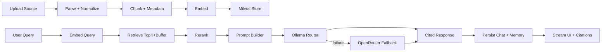

# RFC: NotebookLM Clone (2026-03-05)

## Context
We need a production-capable, open-source NotebookLM-style application that supports multi-user auth, multi-format ingestion, citation-first RAG, conversational memory, and podcast generation while keeping runtime cost low through local-first LLM routing.

Hard constraints:
- FastAPI backend on `localhost:8000`
- Streamlit UI on `localhost:3000`
- Ollama primary and OpenRouter fallback
- Postgres, Milvus, Redis in local infra
- JWT + Google OAuth

## Options

### 1. Conservative
Monolithic Streamlit app with direct service calls and local file persistence.
- Pros: fastest bootstrap, minimal moving parts
- Cons: weak API boundaries, hard to test, poor multi-user isolation
- Build cost: low
- Maintenance cost: high over time

### 2. Balanced (Recommended)
FastAPI backend + Streamlit frontend, shared schema contracts, SQL + vector store + queue.
- Pros: clean boundaries, testable contracts, scalable enough for production
- Cons: more setup than monolith
- Build cost: medium
- Maintenance cost: medium

### 3. Cutting-edge
Event-driven microservices with workflow engine, dedicated rerankers, and advanced observability.
- Pros: best long-term scale and team autonomy
- Cons: highest complexity and operational burden
- Build cost: high
- Maintenance cost: high

## Recommendation
Choose **Balanced**. It is the best tradeoff between delivery speed and production readiness. It avoids lock-in by abstracting LLM providers and keeps strict data contracts across auth, ingestion, retrieval, and generation.

## Data Flow

## Open Questions
- Which local embedding model gives best quality on your corpus under your machine constraints?
- Should podcast generation run synchronous for small jobs and queued for large jobs, or always queued?
- Do we enforce per-user source quotas in v1 or defer to v2?
